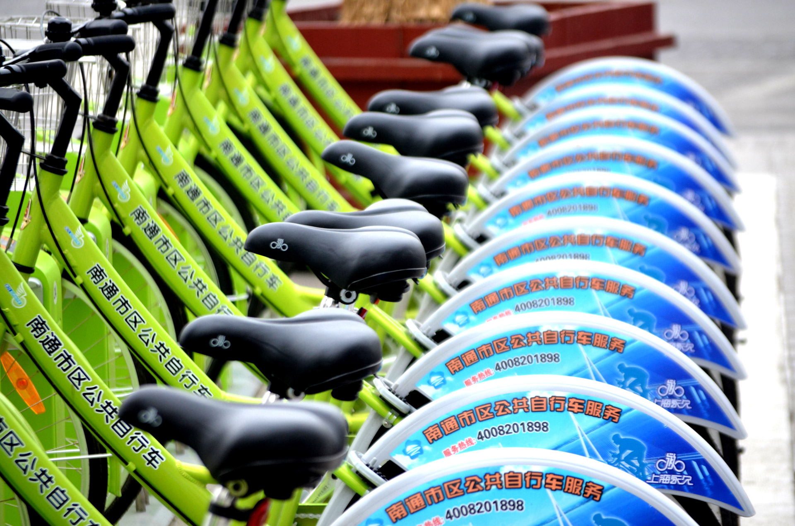
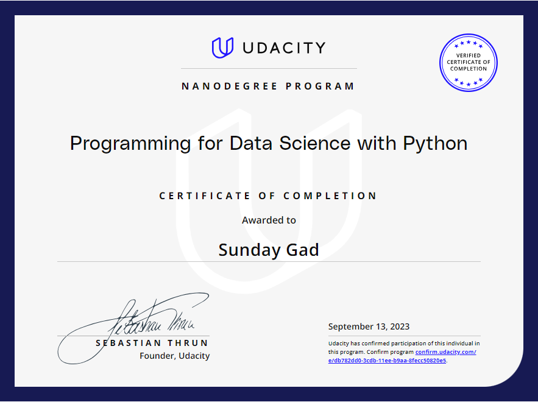

# Udacity-programming-for-Data-Science-using-Python-Nanodegree

# Created by Sunday Gad

This repository contains projects for Udacity Programming For Data Science Using Python Nanodegree.

## Projcet: Investigate a Relational Database using SQl

### Overview

This project consisted in the exploration of a provided database movie rentals in which i had to write and run SQL queries and build visualizations to showcase the output of my queries. 

For the presentation component, i had to create four slides, and each should have (a) a question of interest, (b) a supporting SQL query needed to answer the question, (c) a supporting visualization created using the csv file gotten from the result of the SQL queries that answer the questions of interest, and (d) a small summary on each slide.

### Question Sets

Questions for the project can be found in the slides file 

  

## Project: Explore US bike data using python

### Overview

In this project, i had to make use of Python to explore data related to bike share systems for three major cities in the United States — Chicago, New York City, and Washington. i had to write code to (a) import the data and answer interesting questions about it by computing descriptive statistics, and (b) write a script that takes in raw input to create an interactive experience in the terminal to present these statistics.

### Project Submission

The developed CLI program allows the user to explore an US bikeshare system database and retrieve statistics information from the database. The user is able filter the information by city, month and weekday, in order to visualize statistics information related to a specific subset of data. The user is also able to chose to view raw data.

#### Files Used

The required files for running this program are: 

* [bikeshare.py](https://github.com/Sunday-Gad/Udacity-Projects/blob/main/Explore%20US%20bike%20data%20using%20python/bikeshare_2.py) : This is the main Python script that imports the data, answers interesting questions about it, and creates an interactive experience in the terminal to present these statistics.

* chicago.csv : This file contains bike share data for Chicago.

* new_york_city.csv : This file contains bike share data for New York City.

* washington.csv: This file contains bike share data for Washington.

#### Requirements

This program was written in Python (version 3.7.1) and relies on the following libraries:

* pandas library
* numpy library

#### Usage

To run the project, you will need to have Python installed. Once you have Python installed, you can run the project by opening a terminal window and navigating to the directory where the project files are located. Then, you can run the following command:

`python bikeshare.py`

This will start the interactive experience in the terminal. You can then enter your questions about the data and the script will answer them.

To use the project, you will need to have some basic knowledge of Python. The project is designed to be interactive, so you can get specific information according to month, day of week, month and day, or none from the data. For example, you could ask the following questions:

* What is the most popular start station used on specific day of week?
* What is the average trip duration in a specific moth?
* What is the most popular day of the week for bike rides?
The script will also print out some descriptive statistics about the data.

### Credits

This project was inspired by the Udacity Data Science Nanodegree program. The data for this project was provided by Motivate.

  

# My Certificate of Completion
